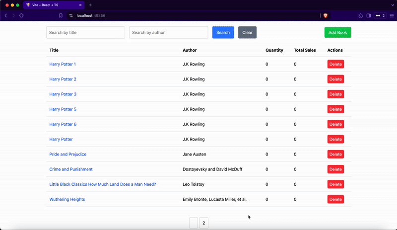
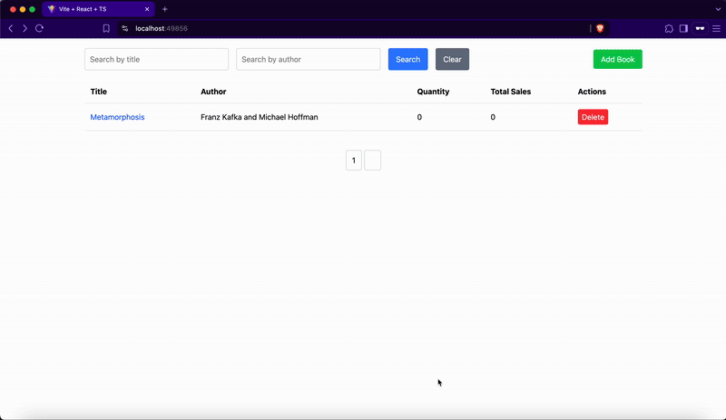
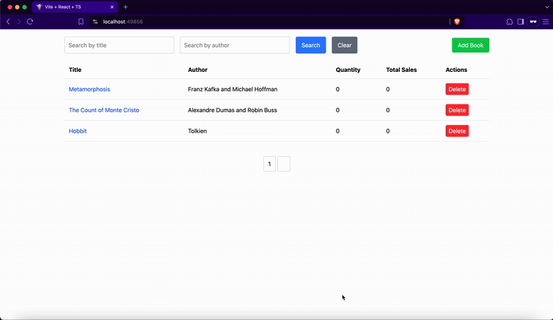
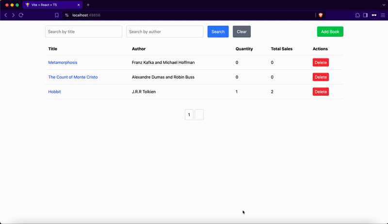

## 실행방법
dotnet 9로 작성되었습니다. dotnet runtime이 [설치되어있어야합니다]('https://dotnet.microsoft.com/en-us/download')

1. 프로젝트 루트에서
2. Book.Server로 이동 (cd Book.Server)
3. 의존성 설치 (dotnet restore)
4. 실행 (dotnet run)

자동으로 client앱도 함께 실행됩니다.


## CRUD
### Create

책 추가 (post /api/books)
```ts
interface Request {
    title: string|null;
    author: string|null;
}
```
```ts
interface Response{
    id:number;
    title:string;
    author:string;
    quantity:number;
    totalSales:number;
}
```
### Read

책 목록조회
```ts
interface Request{
    pageIndex?:number;
    itemPage?:number;
    title:string|null;
    author:string|null;
}
```
```ts
interface Book {
    id: number;
    title: string;
    author: string;
    quantity: number;       
    totalSales: number;  
}

interface Response{
    results:[Book];
    totalRecords:number;
    numberOfRecords:number;
}
```
### Update

책 상세정보
```ts
interface Response{
    id:number;
    title:string;
    author:string;
    quantity:number;
    totalSales:number;
}
```
책 정보 수정
```ts
interface Request{
    title:string;
    author:string;
    quantity:number;
    totalSales:number;
}
```
```ts
interface Response{
    changed:number;
}
```
### Delete

책 삭제
```ts
interface Response{
    id:number;
}
```

